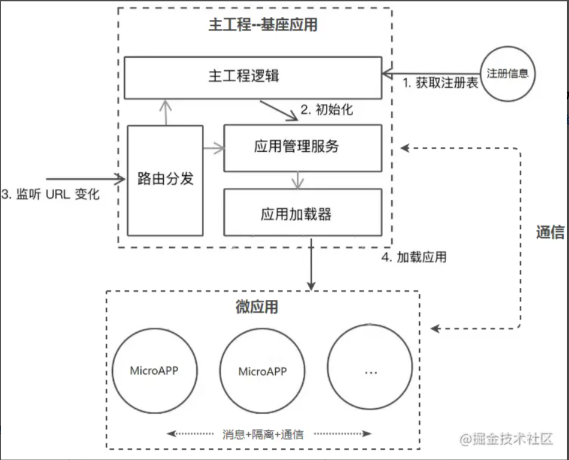

# 微前端

> 微前端（Micro-Frontends）是一种类似于微服务的架构，它将微服务的理念应用于浏览器端，即将 Web 应用由单一的单体应用转变为多个小型前端应用聚合为一的应用。各个前端应用还可以独立运行、独立开发、独立部署。**微前端不是单纯的前端框架或者工具，而是一套架构体**.

## 解决痛点

- **拆分和细化**：SPA应用越来越庞大，难以维护。微前端的意义就是将这些庞大应用进行拆分，并随之解耦，每个部分可以单独进行维护和部署，提升效率
- **整合历史系统**：日常运营的老系统，重构成本高，这些系统需要结合到新框架中来使用还不能抛弃，对此我们也没有理由浪费时间和精力重写旧的逻辑。微前端跨技术栈的整合各个历史系统和新系统并行运行。

## 方案

| 方案 | 说明 | 优点 | 缺点 |
| --- | --- | --- | --- |
| `Nginx路由转发` | 通过Nginx配置反向代理来实现不同路径映射到不同应用，例如www.abc.com/app1对应app1，www.abc.com/app2对应app2，这种方案本身并不属于前端层面的改造，更多的是运维的配置 | 简单，快速，易配置 | 在切换应用时会触发浏览器刷新，影响体验 |
| `iframe嵌套` | 父应用单独是一个页面，每个子应用嵌套一个iframe，父子通信可采用postMessage或者contentWindow方式 | 实现简单，子应用之间自带沙箱，天然隔离，互不影响 | iframe的样式显示、兼容性等都具有局限性；太过简单而显得low |
| `Web Components` | 每个子应用需要采用纯Web Components技术编写组件，是一套全新的开发模式 | 每个子应用拥有独立的script和css，也可单独部署 | 对于历史系统改造成本高，子应用通信较为复杂易踩坑 |
| `组合式应用路由分发` | 每个子应用独立构建和部署，运行时由父应用来进行路由管理，应用加载，启动，卸载，以及通信机制 | 纯前端改造，体验良好，可无感知切换，子应用相互隔离 | 需要设计和开发，由于父子应用处于同一页面运行，需要解决子应用的样式冲突，变量对象污染，通信机制等技术点 |

**当下微前端主要采用的是组合式应用路由方案**，该方案的核心是“主从”思想，即包括`一个基座（MainApp）应用`和`若干个微（MicroApp）应用`，基座应用大多数是一个前端SPA项目，主要负责应用注册，路由映射，消息下发等，而微应用是独立前端项目，这些项目不限于采用React，Vue，Angular或者JQuery开发，每个微应用注册到基座应用中，由基座进行管理，但是如果脱离基座也是可以单独访问

### 路由分发

作为微前端的基座应用，是整个应用的入口，负责承载当前微应用的展示和对其他路由微应用的转发，对于当前微应用的展示。

- 远程拉取机制：微应用页面内容, html + css + js, 库参考`import-html-entry`和`system.js`。
  - 会采用fetch API来首先获取到微应用的HTML内容，
  - 然后通过解析将微应用的JavaScript和CSS进行抽离，采用eval方法来运行JavaScript，
  - 并将CSS和HTML内容append到基座应用中留给微应用的展示区域，
  - 当微应用切换走时，同步卸载这些内容，这就构成的当前应用的展示流程。
- 路由分发：以采用vue-router开发的基座SPA应用来举例
  - 当浏览器的路径变化后，vue-router会监听hashchange或者popstate事件，从而获取到路由切换的时机
  - 最先接收到这个变化的是基座的router，通过查询注册信息可以获取到转发到那个微应用，经过一些逻辑处理后，采用修改hash方法或者pushState方法来路由信息推送给微应用的路由
  - 微应用可以是手动监听hashchange或者popstate事件接收，或者采用React-router，vue-router接管路由，后面的逻辑就由微应用自己控制

### 应用隔离

- CSS隔离
  - CSS Module 或者命名空间的方式，给每个微应用模块以特定前缀，可以采用webpack的postcss插件，在打包时添加特定的前缀。
  - 微应用与微应用之间的CSS隔离就非常简单，在每次应用加载时，将该应用所有的link和style 内容进行标记。在应用卸载后，同步卸载页面上对应的link和style即可

- JS隔离
  - 采用沙箱机制（SandBox）：沙箱机制的核心是让局部的JavaScript运行时，对外部对象的访问和修改处在可控的范围内，即无论内部怎么运行，都不会影响外部的对象。通常在Node.js端可以采用vm模块，而对于浏览器，则需要结合with关键字和window.Proxy对象来实现浏览器端的沙箱。

### 消息通信

> 要让多个分离的微应用之间要做到通信，本质上仍离不开中间媒介或者说全局对象，规范通信约束

- 消息订阅（pub/sub）模式, 事件中心Event
- Redux和Vuex，注意数据耦合

### 身份验证和授权

身份验证通常属于应该由容器应用拥有的横切关注点（cross-cutting concerns）类别
容器可能有某种登录表单，通过它我们可以获得某种令牌token。该令牌将由容器拥有，并且可以在初始化时注入到每个微应用。
最后，微应用可以将令牌连同它向服务器发出的任何请求一起发送，服务器可以执行任何需要的验证
