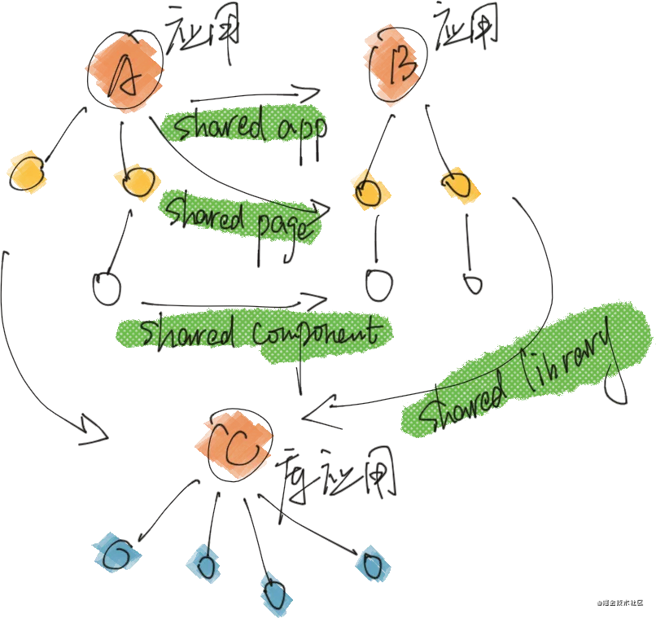

# Module Federation

> 模块联合，多个独立的构建可以组成一个应用程序，这些独立的构建之间不应该存在依赖关系，因此可以单独开发和部署它们

- [webpack MF](https://webpack.docschina.org/concepts/module-federation/)
- [webpack5  MF DEMO](https://github.com/module-federation/module-federation-examples)

## 限制

- webpack5
- 某个应用服务异常，大规模依赖应用崩溃
- 应用的共享模块进行提炼分享出去
- react、vue这一类开发框架的应用，使用mf进行模块共享时还需考虑框架的版本
