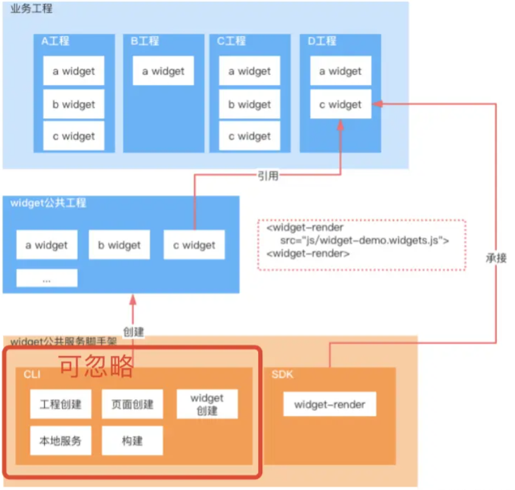

# 多工程间公共模块处理

> 工程之间不仅在业务上，在代码层面也紧密相关。工程多少存在一些公用模块, 发生修改，需要涉及工程同步上线部署，成本很高。

实现目标：一次开发，一次部署，多处应用👍

## 解决方案

### iframe

交互、通信体验不好

### npm publish

npm包发布 + 各业务升级npm包 + 各业务线部署上线

### git subtree / git submodule

可以实现一个仓库作为其他仓库的子仓库，把公共模块抽离为子仓库，各工程引入，实现代码复用。在公共仓库改造完后，需要在各业务工程拉取最新代码，部署上线

### widget-render

将公共模块抽离到公共工程，每个模块打包成一个umd bundle，再用sdk在具体业务工程承接公共模块

## 参考

- [vue多工程间公共模块处理最佳实践](https://juejin.cn/post/6970309861502386184)
