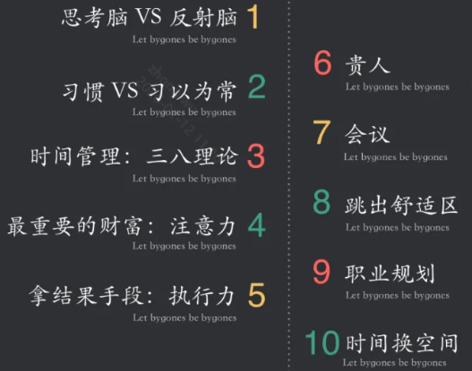
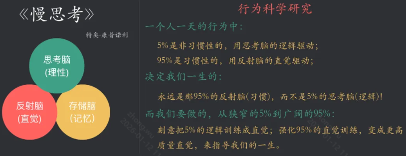
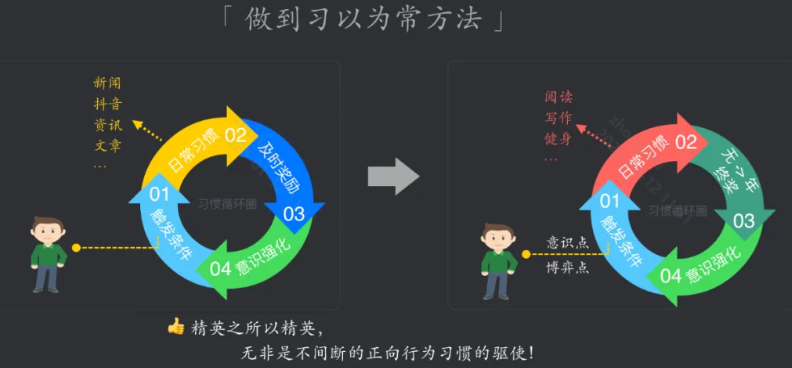
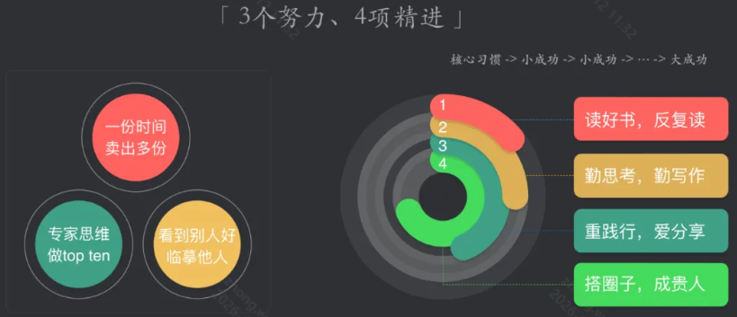
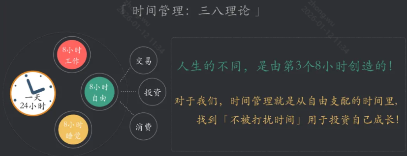
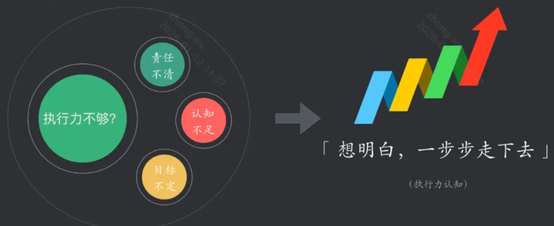
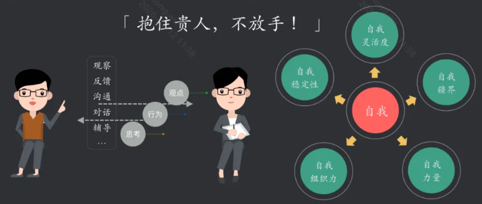
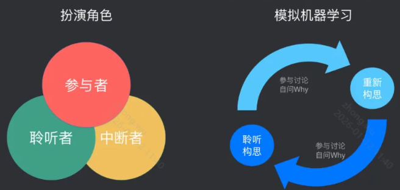
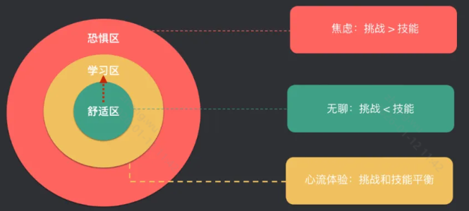
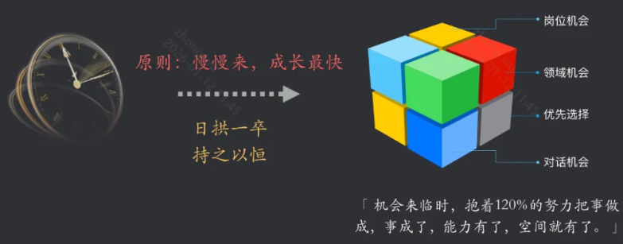

# 个人开发

## 认知准备

- 选择可以带来更多可能性的
- 什么时候定、怎么定、怎么执行
  - 越早越好
  - 先脑暴，再筛选
  - 先拆目标，里程碑包含时间、负责人和具体的大任务；
  - 确定 Deadline

**认知10例**：

1、思考脑与反射脑

2、习以为常

3、时间管理：三八理论

4、最重要的财富：注意力

5、拿结果手段：执行力

6、贵人贵事贵时

7、有效会议

8、跳出舒适区

9、职业规划：工作能力提升、专业技能提升

10、时间换空间

## 产品准备

