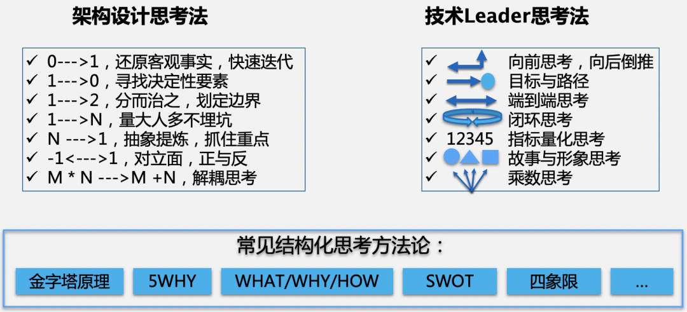
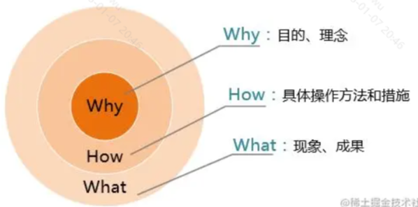
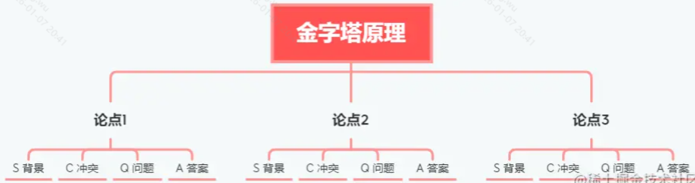

# 团队

## 技术leader

## 汇报

- 金字塔原理+STAR法则 = **季度述职报告**：技术、业务、管理
- 金字塔原理+SCQA模型 = **总结汇报模板**：业务推荐、架构推进、规范推进
- 金字塔原理+PREP模型 = **观点陈述利器**
- 金字塔原则+PDCA循环 = **季度目标执行方法论**
金字塔原理+黄金圈法则 = **架构自研产品演讲推广**

1、MECE 金字塔法则

- 金字塔的层级结构需要满足：每一层的分论点彼此独立不重复，合在一起完整不遗漏
- 论点不重复，论点没遗漏
- 下层是上层的理论支撑，上层是下层结论抽象

2、STAR法则

- Situation 背景
- Task 任务
- Action 行动
- Result 结果
- 举例：

S：XX网站首页秒开率过低（图片过多过大，引入js包过多代码过于复杂）
T：3天内让XX网站首页秒开率达到95%，提高用户体验和留存率
A：图片压缩+缩略图+预加载+懒加载；删除无用js包+合并；使用SSR+CDN加速
R：2天内XX网站首页秒开率达到了99%

3、SCQA 法则

- Situation 背景
- Conflict 冲突
- Question 问题
- Answer 答案
举例：
S：我和小王在联调XX系统XX模块的接口
C：小王偷偷改了接口文档没有通知我，接口报错了测试说是我的锅
Q：怎样防止后台偷改接口文档？
A：接口文档平台要增加记录每次修改内容并通知项目所有人的功能！

4、PREP 法则

- Point 观点
- Reason 理由
- Example 案例
- Point 观点强调
举例：
P：这个需求3天肯定上线不了的
R：UI稿就要2天，前后端开发2天，联调测试2天，少于6天真的不行的
E：上次我同事时间砍半加了一个月班进医院了，项目还是delay了，回来就辞职了。
P：这个需求3天绝对不行，要不你去加时间|协调资源|砍点需求吧

5、PDCA循环

- Plan 计划
- Do 行动
- Check 检查
- Act 处理
- 举例：
P 今年Q1把掘金号从0升到3级
D 写10篇博文，每月3-4篇，每篇100积分
C 每个月底检查进度是否正常，进度慢的分析原因并解决
A 每个月未完成的合并到下个月的PDCA循环里

6、黄金圈法则

- 先理念，而后措施，再到现象，最后是结果。**先要跟人讲“为什么”，而后是“如何做”，最后才是“是什么”**
- 举例：
Why 为什么要自研low code产品：因为这是低水平的重复工作，浪费人力，我们要提效
how 怎么自研这个产品：提取业务组件、区块，研发中后台搭建平台拖拽生成
what 这个产品能干嘛：无需开发，快速生成系统并上线
