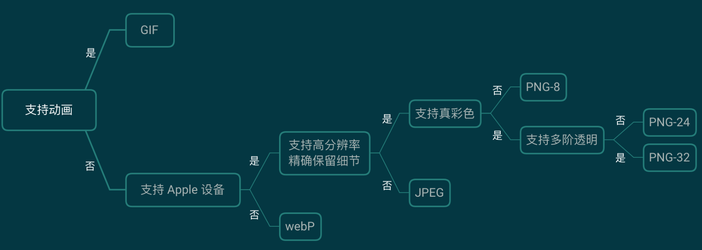

# 图表性能优化

> Web 页面性能优化，解决了图片相关，问题就解决了大半

[https://juejin.im/post/5dc7fb87e51d454b4213c934?utm_source=gold_browser_extension](https://juejin.im/post/5dc7fb87e51d454b4213c934?utm_source=gold_browser_extension)

## 基本知识

> 整理于网络公开信息。

### 名词解释

- **有损压缩**：借由将次要的信息数据舍弃，牺牲一些质量来减少数据量、提高压缩比。这个过程是不可逆的。图片常见的有损压缩手段是合并相近的像素点。

- **无损压缩**：数据经过压缩后，信息不受损失，还可以完全恢复到压缩前的样子。无损压缩技术一般是通过两个步骤来完成：

  - 产生输入数据的统计模型。
  - 利用这个统计模型将较常出现的数据用较短的比特序列表示，较不常出现的数据用较长的比特序列表示。

- **索引色（Indexed Color）**：一个字节 2^8 表示一个颜色，也就是最多支持 256 种颜色。

- **直接色（Direct Color）**：4 个数字表示一个颜色，分别表示红、黄、蓝以及透明度，所以最多可以表达 2^32 种颜色。

- **位图（Bitmap）**：又叫栅格图、点阵图，使用像素阵列来表示图像。位图就是由象素阵列的排列来实现其显示效果的，每个象素有自己的颜色信息，在对位图图像进行编辑操作的时候，可操作的对象是每个象素，我们可以改变图像的色相、饱和度、明度，从而改变图像的显示效果。位图根据位深度，有 1、4、8、16、24、32 位图像等。位图放大会失真变模糊。

- **矢量图**：计算机图形学中用点、直线或者多边形等基于数学方程的几何图元表示图像。相比较位图，矢量图保存最少的信息，体积更小，缩放不会失真。

- **通道**：RGB 三种颜色信息称为红通道、绿通道、蓝通道，透明度是 Alpha 通道。

### Web常用图片格式

- **JPEG/JPG**：使用 JPEG 格式压缩的图片文件，是目前应用最广泛的图片格式之一。最普遍被使用的扩展名格式为.jpg，其他常用的扩展名还包括 .jpeg、.jpe、.jfif 以及 .jif。联合图像专家小组（Joint Photographic Experts Group）1992 年发布 JPEG 压缩标准，1994 年获得 ISO10918-1 认证。其特点是有损压缩，直接色，位图，体积最小，常用于颜色较丰富、无透明要求的图片。

- **PNG**：PNG 是一种无损压缩的位图图形格式，支持索引、灰度、RGB 三种颜色方案以及 Alpha 通道等特性。PNG 的开发目标是改善并取代 GIF 作为适合网络传输的格式而不需专利许可。名称由来一个是 Portable Network Graphics（便携式网络图形），还有一个非正式的由来是 "Png is Not Gif"。使用场景是带有透明、半透明背景的图片，需要在网络传输中显示预览效果后展示全貌。上古时期的 IE6 不支持 PNG 半透明，需要用 hack 方法解决。PNG 体积比较大，非必须可用 JPG 替代。PNG 有 png8、png24、png32 之分。

  - **png8**: 最多支持 256 色的 PNG，无损、索引色的位图。非动图可以替代 GIF，体积更小，透明度支持也更好。
  - **png24**： 最多支持 2^24 色的 PNG，不支持透明，无损、直接色的位图。目标是替换 JPG，但一般来说，相同显示效果，PNG 图片是 JPG 体积的数倍。
  - **png32**： 加上 8 位 Alpha 通道的 png24。（注：PS 中导出图片时选择 png24，勾选透明度，导出的是png32）。

- **GIF**：图像互换格式（Graphics Interchange Format）是一种位图图形文件格式，无损压缩、索引色。原始版本为 87a，1989 年发布 89a 版本，支持多帧动画和透明色。1995 年 Netscape Navigator 2.0 发布，定义了动画循环多少次或是否无限次播放，现在聊天的动图都是基于该版本的 GIF。GIF 的特性如下：

  - 优秀的 LZW 算法在保证质量的同时将体积变的更小。
  - 可插入多帧实现动画效果。
  - 可实现透明效果。
  - 最多支持 256 色，故不适用于真彩色图片。

- **WebP**：Google 2010 年发布的同时支持有损和无损压缩的图片文件格式。有损用来替换 JPG，无损用来替换PNG，动态用来替换 GIF。根据 Google 较早的测试，WebP 的无损压缩比网络上找到的 PNG 档少了 45％ 的文件大小，即使这些 PNG 档在使用 Pngcrush 和 PNGOUT 处理过，WebP 还是可以减少近 30％ 的文件体积。WebP 目前还不能全平台兼容，相关兼容性可点此链接查看。

- **SVG**：可缩放矢量图形（Scalable Vector Graphics）是一种基于可扩展编辑语言（XML），用于描述二维矢量图形的图形格式。SVG 由 W3C 制定，是一个开放标准。SVG 的优点是文件可读，易于修改编辑。支持多种滤镜和特殊效果，在不改变图像内容的前提下可以实现位图中类似文字阴影的效果，还可以生成动态图形。

## 请求优化

- HTTP/2
- 多路复用

### 懒加载

> 只加载可视区的内容，当页面向下滚动时，再继续加载后面的内容

[react-lazyload](https://github.com/twobin/react-lazyload)

图片懒加载的原理其实非常简单，我们先不设置图片的 src 属性，将图片的真实路径放到一个浏览器不认识的属性中（比如 data-src），然后我们去监听 scroll 事件。当页面的 scrollTop 与浏览器的高度之和大于图片距页面顶端的 Y (注意是整个页面不是浏览器窗口)时，说明图片已经进入可视区域，这是把 data-src 的值放到 src 中即可。

**为什么要使用懒加载**？

- 对于大多数用户，特别是移动端和网速比较的用户，如果首屏加载过多的图片，页面将会加载得很慢而且浪费用户的流量。
- Javascript 脚步通常要等到 DOM 加载完后才会执行，如果加载的资源过多，可能会影响网页的正常使用。
- 能够节省流量和减轻服务器压力，更近一步就是能够为公司省成本。

### 缓存

浏览器和服务器之间使用的缓存策略可以分为强缓存、协商缓存两种：

- 强缓存：在缓存数据未失效的情况下，不需要再和服务器发生交互
- 协商缓存：需要与服务端校验是否使用缓存

### 雪碧图

雪碧图，CSS Sprites，国内也叫 CSS 精灵，是一种 CSS 图像合成技术，主要用于小图片显示。

`background-image + background-position`

### iconfont

iconfont 译为字体图标，即通过字体的方式展示图标，多用于渲染图标、简单图形、特殊字体等。

[iconfont.cn](https://www.iconfont.cn/)

使用 iconfont 时，由于只需要引入对应的字体文件，针对加载图片张数较多的情况，可有效减少 HTTP 请求次数，而且一般字体体积较小，所以请求传输数据量较少。与直接引入图片不同，iconfont 可以像使用字体一样，设置大小和颜色，还可以通过 CSS 设置特殊样式，且因为其是矢量图，不存在失真的情况。

> 根据开发需求，按需引入不同格式的字体文件（eot / ttf / woff / svg）

```html
<style>
  @font-face {
    font-family: "iconfont";
    src: url('iconfont.eot'); /* IE9*/
    src: url('iconfont.eot?#iefix') format('embedded-opentype'), /* IE6-IE8 */
         url('iconfont.woff') format('woff'),
         url('iconfont.ttf') format('truetype'), /* chrome, firefox, opera, Safari,  Android, iOS 4.2+*/
         url('iconfont.svg?#iconfont') format('svg'); /* iOS 4.1- */
  }

  .iconfont {
    font-family: "iconfont";
  }
</style>

<body>
  // &#xe609 是一个字符的 unicode 码，在该 iconfont 字体文件中对应某个图标
  <i class="iconfont">&#xe609</i>
</body>

```

### 使用 Base64

> Base64 是网络上最常见的用于传输 8Bit 字节码的编码方式之一，可将图片编码为特定的字符串，由 52 个大小字母和 10 个数字，以及 +、/、= 三个字符组成

使用 Base64 编码渲染图片有以下优点：

- 有效减少 HTTP 请求次数
- 可对数据进行简单加密，无法肉眼获取信息
- 没有跨域问题，无需考虑图片缓存

凡事皆有利弊，使用 Base64 编码同时也会带来一些问题：

- 编码后文件体积增大，仅适用于小体积图片编码
- 增加了编码和解码的工作量
- 不支持 IE 8.0 以下版本

如需将图片转换为 Base64 编码，可以使用 `JavaScript API FileReader.readAsDataURL`

## 体积优化

> 图片体积压缩就是在图片保持在可接受的清晰度范围内同时减少文件大小，图片体积压缩可以借助工具实现。

[https://tinypng.com/](https://tinypng.com/)

## 格式、尺寸优化



### 多倍图

> 在 Retina 视网膜屏幕面世之前人们很少关注像素密度与设备像素比，随着 Retina 屏在移动设备中越来越广泛地应用，为了保证图片在不同 DPR（设备像素比）的设备上显示足够清晰，开发者需要针对不同设备适配不同倍数的图片。

像素相关概念

- **DP** 设备像素，又名物理像素，即设备屏幕上真实的物理像素，以矩阵的形式排列，如 iphone X 屏幕分辨率为 2436*1125，即屏幕每行包含 1125 个物理像素，每列包含 2436 个物理像素。

- **DIP** 设备无关像素，是一种基于屏幕坐标的抽象像素，应用程序以抽象像素为单位，如我们 CSS 中使用的 px，实际渲染时通过底层程序转换为物理像素。

- **DPR** 设备像素比，设备像素 / 设备无关像素的值即为设备像素比，在 Javascript 中可以通过 `window.devicePixelRatio` 来获取。

针对一张 `30px * 30px` 的图片，在 1 倍屏上，按照 1 : 1 平铺，图片质量并不损失。但是在 2 倍屏、3 倍屏上，分别通过 `60 * 60` 与 `90 * 90` 个物理像素渲染这张图片就会出现模糊、失真的现象，从而影响用户体验。所以，我们需要根据不同 DPR 去加载不同倍数的图片：

- 一倍屏上加载 30px * 30px 的图片，我们称之为一倍图。
- 二倍屏上加载 60px * 60px 的图片，图片名一般加上 @2x 标识，我们称之为二倍图。
- 三倍屏上加载 90px * 90px 的图片，图片名一般加上 @3x 标识，我们称之为三倍图。

**自适应 DPR 加载图片**:

在高分辨率显示屏如 2x 上，在页面中使用二倍图可以保证清晰度，但是当此页面在低 DPR 设备打开时，我们只需要 50% 长宽的图片就能保证显示效果，而此时带宽开销却是一样的。所以为了节约传输流量，我们需要告诉浏览器，根于不同的 DPR 加载不同尺寸的图片，通常有以下三种方法：

- 使用 picture 标签，除了 IE，现有主浏览器均已支持该标签

```js
<picture>  
  <source srcset="photo@3x.jpg" media="(min-width: 800px)">  
  <source srcset="photo@2x.jpg" media="(min-width: 600px)">  
    
</picture>
```

- 使用 img srcset 属性，除了 IE，现有主浏览器均已支持该属性。

```html

```

- 使用 CSS3 img-set 函数，兼容性相较于前两者较差。

```js
background-image: image-set("photo.png" 1x,
                            "photo@2x.png" 2x,
                            "photo@3x.png" 3x);
```
